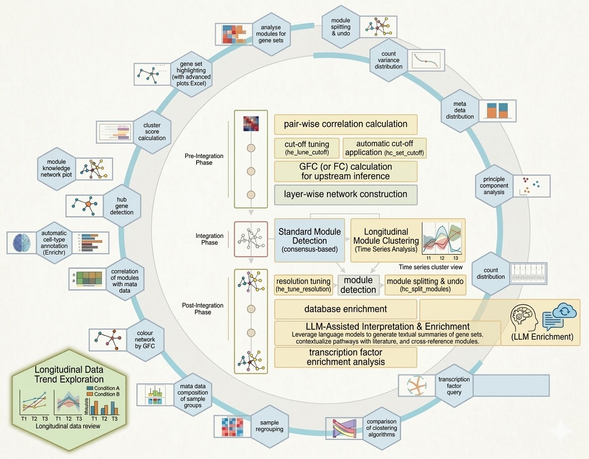

# hcocena

[](https://github.com/BioCompNet/hcocena/actions/workflows/R-CMD-check.yaml)

`hcocena` is an R package for horizontal integration and downstream analysis of
transcriptomics datasets. It provides a modern S4 workflow built around
`HCoCenaExperiment` for reproducible network-centric transcriptomics analyses.



The package supports both multi-layer integration, such as RNA-seq plus array
data, and single-layer analyses using the same API. The focus is a
module-centric workflow: from data import and correlation-based network
construction to clustering, heatmaps, functional enrichment, upstream
inference, cell-type annotation, longitudinal analysis, and optional
LLM-assisted module interpretation.

## What hcocena provides

- S4-first workflow with `HCoCenaExperiment`, `MultiAssayExperiment`, and
  `SummarizedExperiment`
- Correlation cutoff tuning and automatic cutoff selection helpers
- Clustering, integrated network construction, module splitting, and hCoCena
  heatmaps
- Functional enrichment across multiple databases with export helpers
- Upstream inference with DoRothEA and PROGENy via `decoupleR`
- Cell-type annotation helpers and reference-data preview utilities
- Longitudinal module and endotype analyses

## Repository structure

- Package source is at the repository root and follows the Bioconductor
  layout
- Analysis templates are kept in [`inst/scripts/workflows/`](inst/scripts/workflows/)
- CI for R CMD check and BiocCheck (release and Bioconductor devel) is defined
  in [`.github/workflows/R-CMD-check.yaml`](.github/workflows/R-CMD-check.yaml)

## Contributors

- [Waqar Hanif](https://github.com/waqarhanif-biocode)

## Installation

After Bioconductor acceptance:

```r
if (!requireNamespace("BiocManager", quietly = TRUE)) {
  install.packages("BiocManager")
}
BiocManager::install("hcocena")
```

For local development or pre-submission testing from a checkout:

```r
install.packages("remotes")
remotes::install_local(".", dependencies = TRUE, upgrade = "never")
```

## Minimal S4 workflow

```r
library(hcocena)

hc <- hc_init()
hc <- hc_set_paths(
  hc,
  dir_count_data = "/path/to/counts/",
  dir_annotation = "/path/to/annotation/",
  dir_reference_files = "/path/to/reference/",
  dir_output = tempdir()
)
hc <- hc_define_layers(
  hc,
  data_sets = list(
    Layer1 = c("counts.tsv", "anno.tsv")
  )
)
hc <- hc_read_data(
  hc,
  gene_symbol_col = "SYMBOL",
  sample_col = "SampleID",
  count_has_rn = FALSE,
  anno_has_rn = FALSE
)
hc <- hc_run_expression_analysis_1(hc, export = FALSE)
hc <- hc_plot_cutoffs(hc, interactive = FALSE)
```

For a reproducible package-based example, install `hcocena` and run:

```r
browseVignettes("hcocena")
```

The package ships toy data and prepared example objects in `inst/extdata` to
support documentation, testing, and manual smoke tests.

## Analysis templates

The longer walkthroughs the package is normally driven from are installed with
it, so they are available from an installed copy and not only from a clone:

- `inst/scripts/workflows/hcocena_main.Rmd` -- full analysis, import to enrichment
- `inst/scripts/workflows/hcocena_satellite.Rmd` -- optional downstream analyses

```r
dir(system.file("scripts", "workflows", package = "hcocena"))

file.copy(
  system.file("scripts", "workflows", "hcocena_main.Rmd", package = "hcocena"),
  "hcocena_main.Rmd"
)
```

They are templates, not reproducible documents: they point at your own count
and annotation files, and several steps contact external services (ChEA3,
Enrichr, DoRothEA, Cytoscape, LLM providers). The built vignette
(`vignette("hcocena-s4-workflow")`) is the runnable short version.

One practical note: when using longitudinal imputation with
`impute_method = "rfcont"`, attach `CALIBERrfimpute` in the session first:

```r
library(CALIBERrfimpute)
```

## Documentation and references

- Bioinformatics paper:
  https://doi.org/10.1093/bioinformatics/btac589
- STAR Protocol:
  https://star-protocols.cell.com/protocols/3341

## Citation

Marie Oestreich, Lisa Holsten, Shobhit Agrawal, Kilian Dahm, Philipp Koch,
Han Jin, Matthias Becker, Thomas Ulas (2022). "hCoCena: horizontal integration
and analysis of transcriptomics datasets." *Bioinformatics* 38(20):4727-4734.
doi:10.1093/bioinformatics/btac589
